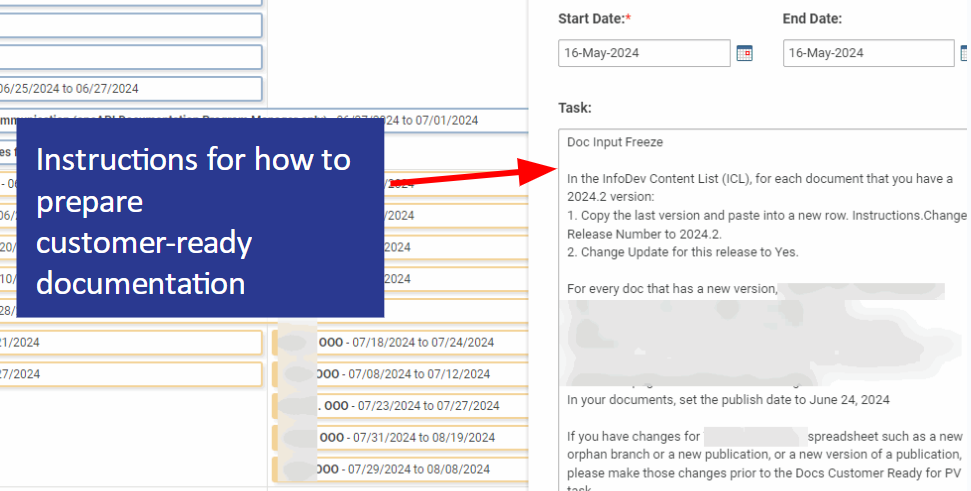

.. _content-strategy:

Content Strategy and Optimizaiton
#################################

I led a team of 15 Technical Writers to deliver 80 documents for quarterly
software releases. My role was to ensure:
- global changes were implemented across all documents
- deadlines were met
- quality standards were met
- coordination between cross functional teams

To achieve these goals, I implemented tools and processes to make improvements such as:

* Moved deadlines for Objectives and Key Results so that they don't conflict
  with release deadlines.
* Submitted documentation to the validation team earlier than required to give
  them more time to validate and cut the amount of time my team spends
  investigating and responding to validation requests.

Planning
********

I created this SmartSheet Calendar for our team to see overlap in deadlines for
software releases, Gladius tasks (software life cycle), quarterly objectives,
and time out of office.

.. note::

   Proprietary information has been blurred out.

.. image:: images/plan1.png
   :width: 2000
   :alt: A SmartSheet calendar view showing overlapping deadlines. 

Continuous improvement
======================

.. image:: images/plan2.png
   :width: 2000 
   :alt: A SmartSheet calendar view showing overlapping deadlines. 

Tracking
********

Engineers and product owners assign Jiras to the Information Development
(InfoDev) Team. My job was to ensure we have the information needed to implement
a Jira, and that the Jira is being worked on by our team when we have the
information we need.

         then how that Jira is tracked to completion.

Using a Microsoft SharePoint List, I was able to create an accessible place for
Technical Writers as well as stake holders to be able to see the status of a specific
document, or see the overall progress toward the release schedule. This list provided
these advantages:

   * Opens quickly in a web browser.
   * Users can create customized views to show data such as:
     - documents assigned to a specific user
     - documents for a specific product 
     - overdue documents, or 
     - completed documents
     This data was used
     to produce indicator reports and balance resources.
   * Users could be assigned write permissions or read-only permissions.  

.. image:: images/splist1.png
   :width: 2000
   :alt: A table showing how users can quickly identify the owner of a document, the publishing
         status, and the ability to display customized views.

Document Details
================

         status, and the ability to display customized views.

Improving
*********

After a reduction in workforce, our Product Validation team had to shift their
documentation validation timeline to the day before we started publishing. Since
validation takes 2-3 days, we were publishing documentation that had not been
validated yet.

To fix this problem, I implemented these process improvements:
   #. Delivered customer-ready documentation at earlier drop date, even if it was not final.
   #. Consolidated validation databases to reduce false hits.
   #. Automated broken link checker.

.. image:: images/improving.png
   :width: 1500
   :alt: A chart showing the progression of three software releases. The first two releases show that
         validation had less than 7 business days to complete validation. After Ben Moore implemented
         process changes, validiation had more than 10 days for validation.

I implemented a minimum set of documentation standards that enabled our team to
deliver customer-ready documentation to the validation team four days sooner
than in past releases.     

.. image:: images/process-improvement1.png
   :width: 2000
   :alt: A calendar showing the change in process along with instructions for how to do the new process.

Step by Step instructions
=========================

