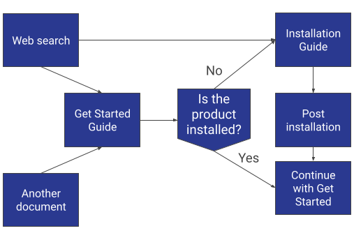
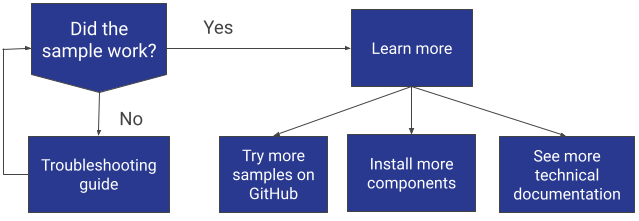

.. _info-architecture:

Information Architecture
########################

Get Started Entry Points
************************

For quarterly software releases at Intel, I worked with our User Expereince team to
optimize the experience for developers who were new to the Intel® oneAPI ecosystem of  
compilers, libraries, and tools. We determined where users were coming from and
where to guide them for the next step.

        when arriving to a Get Started Guide. 

Get Started Next Steps
**********************

After a user completes the get started steps, they run a sample to ensure the
system is working correctly. From there, the user gets directed to next level
steps or the troubleshooting guide.

        A successful run of the sample directs them to Learn More about the product,
        an unsuccessful run directs them to the Troubleshooting Guide. 

