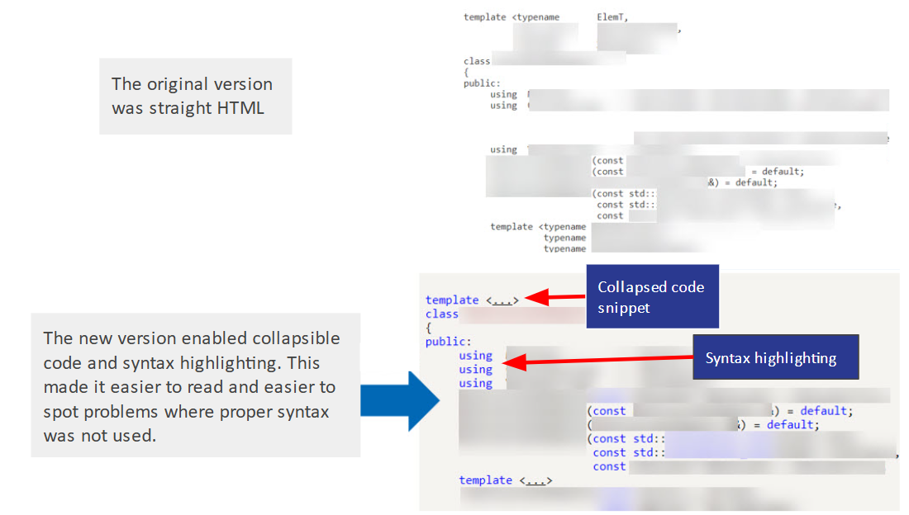

.. _usability:

Documentation Usability
#######################

For the Intel® Autonomous Driving Library User Guide, I created a way to convert
content from IBM DOORS Next Generation into HTML content, then implement code
snippet collapsing and code snippet highlighting using a combination of Doxygen
for converting files and JavaScript to implement the highlighting.

.. note::

   Proprietary information has been blurred out.

         compared to the updated version where I used JavaScript to implement
         syntax highlighting and collapsible code snippets. 
